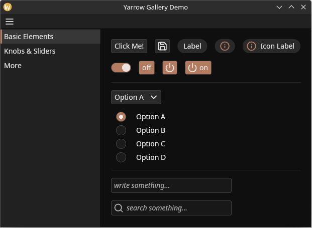
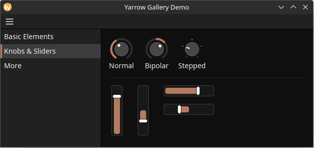

# Yarrow

> **WORK IN PROGRESS. This project is currently in alpha and is missing some features. Check the [roadmap] for more details.**

**A modern retained-mode GUI library in Rust with extreme performance and control, geared towards audio software.**

# What to Expect

The goal of Yarrow is different from most other modern GUI libraries. Instead of focusing on typical declarative, styling, and layout concepts, Yarrow instead provides a powerful and novel retained-mode API with lots of control over exactly how elements are styled, laid-out, interacted with, and rendered. State management is also somewhat inspired by the [Elm]/[Iced] architectures.

The main focus is audio software. Only features that are needed for the [Meadowlark DAW Project](https://github.com/MeadowlarkDAW/Meadowlark) and its audio plugins are planned.

# Features

* Cross-platform (Linux, Mac, and Windows)
* Native and lightweight
* Hardware-accelerated rendering in [wgpu] with support for text, vector graphics, textures, and/or custom shaders
* Extreme performance (you are in control over exactly how your elements are updated)
* Can be used for both standalone applications and audio plugins
* Designed from the ground-up to support multi-windowed applications
* Scaling support (with built-in support for hi-dpi texture assets)
* [Pointer locking](https://developer.mozilla.org/en-US/docs/Web/API/Pointer_Lock_API) for knob and slider elements
* Accessibility support*
* [Permissive MIT license](./LICENSE)

> \*Yarrow does not automatically set up accessibility for you. You must manually provide Yarrow with information on how accessibility tools should navigate your program.

# How it Works

Yarrow takes a novel approach to GUI. Instead of having you think of your GUI in terms of a "widget tree", Yarrow has you think in terms of how elements (widgets) are actually rendered. There are no "parent elements". There are only elements, z indexes, and scissoring rectangles. No mucking around with margins, padding, vertical/horizontal list containers, grid containers, dividers, panels, etc. to get the layout you want. Instead you just simply define a function that sets the position and size of each element. Additionally, scissoring rectangles have a "scroll offset" vector which can be used to create scroll regions.

Yarrow is not declarative. Elements are added and removed dynamically at runtime. Each newly created element returns a handle to that element.

Yarrow uses an event-driven update system somewhat inspired by the [Elm]/[Iced] architectures. Elements cannot mutate application state, they can only send actions (events) to a global action queue. Actions are processed in a single monolithic user-defined action handler method. Inside this method, the user mutates their state and updates elements accordingly.

There is no "cascading" styling system, instead each element type just defines its own styling struct.

Rendering is done in [wgpu] using the [RootVG](https://github.com/MeadowlarkDAW/rootvg) library. Elements can also be rendered using custom wgpu shaders.

# Get Started

To get started, read the [book] (TODO).

> This repository only houses the GUI library. For examples and guides on how to use Yarrow for audio plugin development, see (TODO).

# Contributing

(TODO)

[wgpu]: https://wgpu.rs
[roadmap]: ROADMAP.md
[Elm]: https://elm-lang.org
[Iced]: https://github.com/iced-rs/iced